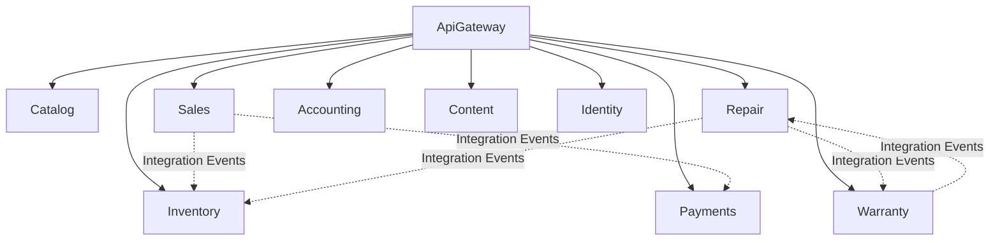

# System Architecture

## Overview
The system follows a **Modular Monolith** architecture, where the application is a single deployable unit but structured into distinct, loosely coupled modules. Each module encapsulates a specific business domain.

## Module Map

## Module Descriptions

### Core Modules
- **Catalog**: Manages products, categories, brands, and attributes.
- **Sales**: Handles shopping cart, orders, and checkout process.
- **Identity**: Manages users, roles, and authentication.

### Operational Modules
- **Repair**: core business logic for device repairs (booking, work orders, technician assignment).
- **Inventory**: Tracks stock, purchase orders, and serial numbers.
- **Warranty**: Manages warranty claims, serial validaton, and RMA flows.

### Financial Modules
- **Accounting**: Manages invoices, VAT, accounts receivable/payable, and B2B credit limits.
- **Payments**: Handles payment processing, idempotency, and gateway integration (Stripe, VnPay).

### Marketing
- **Content**: Manages blog posts, banners, and coupon engine.

## Key Technical Patterns

### Shared Kernel
The `BuildingBlocks` library contains common abstractions used across all modules:
- **Entity**: Base class for domain entities with audit fields.
- **Result**: Functional error handling pattern.
- **Domain Events**: Internal events for decoupling logic within a module.
- **Outbox**: Reliability pattern for publishing integration events.

### Data Isolation
Each module has its own `DbContext` and schema within the PostgreSQL database to ensure data sovereignty. Cross-module data access is strictly forbidden at the database layer.

### Communication
- **Synchronous**: Direct method calls (within process) via public interfaces/contracts (Application layer).
- **Asynchronous**: RabbitMQ for significant business events (e.g., `OrderPlaced`, `PaymentSucceeded`).
